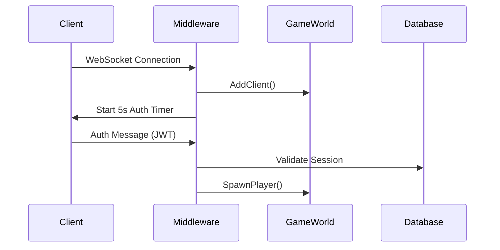

# C# Game Server Architecture Overview

## High-Level Architecture

The MMO C# game server is built on **ASP.NET Core** with **WebSocket** support and uses a **service-oriented architecture** with dependency injection. The server manages real-time multiplayer gameplay with tile-based movement, chunk-based terrain loading, and robust session management.

### Core Components

```
┌─────────────────┐    ┌─────────────────┐    ┌─────────────────┐
│   WebSocket     │────│  Game World     │────│   Database      │
│   Middleware    │    │   Service       │    │   Service       │
└─────────────────┘    └─────────────────┘    └─────────────────┘
         │                       │                       │
         │                       │                       │
┌─────────────────┐    ┌─────────────────┐    ┌─────────────────┐
│  Connected      │    │   Terrain       │    │  Game Loop      │
│  Client         │    │   Service       │    │  Service        │
└─────────────────┘    └─────────────────┘    └─────────────────┘
         │                       │                       │
         │                       │                       │
┌─────────────────┐    ┌─────────────────┐              
│    Player       │    │  Pathfinding    │              
│    Model        │    │   Service       │              
└─────────────────┘    └─────────────────┘              
```

## Service Architecture

### Service Registration (Program.cs:11-18)
All core services are registered as **singletons** to maintain shared state across WebSocket connections:

```csharp
builder.Services.AddSingleton<DatabaseService>();
builder.Services.AddSingleton<GameWorldService>();
builder.Services.AddSingleton<TerrainService>();
builder.Services.AddSingleton<PathfindingService>();
builder.Services.AddHostedService<GameLoopService>();
```

### Service Interactions

1. **WebSocketMiddleware** acts as the entry point, handling all WebSocket connections and message routing
2. **GameWorldService** manages client connections and broadcasting
3. **DatabaseService** handles PostgreSQL operations for both auth and game databases
4. **TerrainService** manages chunk loading/unloading based on player positions
5. **GameLoopService** runs the deterministic game loop at 500ms intervals
6. **PathfindingService** provides A* pathfinding for movement validation

## Connection Flow

### 1. WebSocket Connection (WebSocketMiddleware.cs:37-122)



### 2. Authentication Process (WebSocketMiddleware.cs:203-411)

The authentication system has **multiple layers of protection**:

1. **Database Session Check**: Primary protection using `active_sessions` table
2. **In-Memory Connection Check**: Secondary protection against race conditions
3. **Database-Level Locking**: Prevents concurrent logins with `FOR UPDATE` queries
4. **Post-Authentication Validation**: Final validation after client setup

### 3. Soft Reconnection System

The server supports **soft disconnections** where players can reconnect within a 30-second window:

- **Hard Disconnect**: Explicit logout via `quit`/`logout` messages
- **Soft Disconnect**: Browser closed, network issues, etc.
- **Reconnection**: New WebSocket attached to existing Player object

```csharp
// Soft reconnect logic (WebSocketMiddleware.cs:293-321)
existingClient.WebSocket = client.WebSocket;
existingClient.DisconnectedAt = null;
existingClient.LastActivity = DateTime.UtcNow;
```

## Game Loop Architecture

### Deterministic Tick System (GameLoopService.cs:66-118)

The game loop runs at **500ms intervals** to match the original JavaScript implementation:

1. **Parallel Movement Calculation**: All player movements calculated concurrently
2. **Sequential State Updates**: Movement results applied deterministically
3. **Dirty Flag System**: Only broadcast players with state changes
4. **Heartbeat System**: Optional network heartbeats for latency monitoring

```csharp
// Parallel movement processing
var movementTasks = new List<Task<(ConnectedClient, (float x, float y)?)>>();
foreach (var client in clients)
{
    if (client.Player?.HasActivePath() == true)
    {
        movementTasks.Add(ProcessPlayerMovementAsync(client));
    }
}
```

### Cleanup and Monitoring (GameLoopService.cs:149-224)

A separate 30-second timer handles:

- **Duplicate User Detection**: Critical safety check for multiple logins
- **Idle Timeout**: 2-minute inactivity timeout
- **Disconnect Timeout**: 30-second soft disconnect window
- **Session Cleanup**: Database session removal on final disconnect

## Terrain System

### Chunk-Based Loading (TerrainService.cs)

The terrain system uses **16x16 tile chunks** with **reference counting**:

```csharp
private readonly ConcurrentDictionary<string, TerrainChunk> _chunks = new();
private readonly ConcurrentDictionary<int, string> _playerChunks = new();
private readonly ConcurrentDictionary<string, int> _chunkRefCounts = new();
```

#### Chunk Management Flow:
1. **Player Movement**: Triggers `UpdatePlayerChunk()` 
2. **Chunk Loading**: Synchronous loading from JSON files
3. **Reference Counting**: Tracks which players need each chunk
4. **Automatic Cleanup**: Unused chunks removed after 30 seconds

#### Pathfinding Integration:
- **A* Algorithm**: Server-side pathfinding using walkability data
- **Movement Validation**: Every movement validated against terrain
- **Chunk Loading**: Missing chunks loaded on-demand for pathfinding

## Player Visibility System

### Current Implementation Issue ⚠️

**IDENTIFIED PROBLEM**: All players are visible to all other players regardless of chunk loading status.

#### Current Spawn Logic (WebSocketMiddleware.cs:534-556):
```csharp
// Send to all clients (including self)
await _gameWorld.BroadcastToAllAsync(spawnMessage);

// Send other players to the new client
var otherPlayers = _gameWorld.GetAuthenticatedClients()
    .Where(c => c.Player != null && c.Player.UserId != client.Player.UserId)
    .Select(c => new
    {
        id = c.Player!.UserId,
        username = c.Username,
        xPos = c.Player.X,
        yPos = c.Player.Y
    })
    .ToList();
```

#### Problem Analysis:
1. **No Distance Filtering**: `spawnOtherPlayers` includes ALL authenticated players
2. **No Chunk Awareness**: Players sent regardless of whether their chunks are loaded
3. **Frontend Impact**: Unity client receives players in unloaded terrain areas

#### Recommended Solution:
The spawn logic should filter players based on **chunk proximity**:

```csharp
// Proposed fix - only send players in loaded/nearby chunks
var playerChunk = _terrain.WorldPositionToChunkCoord(client.Player.X, client.Player.Y);
var otherPlayers = _gameWorld.GetAuthenticatedClients()
    .Where(c => c.Player != null && c.Player.UserId != client.Player.UserId)
    .Where(c => {
        var otherChunk = _terrain.WorldPositionToChunkCoord(c.Player.X, c.Player.Y);
        var distance = Math.Max(Math.Abs(otherChunk.chunkX - playerChunk.chunkX), 
                               Math.Abs(otherChunk.chunkY - playerChunk.chunkY));
        return distance <= 1; // Only include players in current or adjacent chunks
    })
    .Select(c => new { ... })
    .ToList();
```

## Database Architecture

### Dual Database Setup:
- **Auth Database** (`mmo_auth`): User accounts, sessions, authentication
- **Game Database** (`mmo_game`): Player positions, game state

### Session Management Tables:

#### `active_sessions` (Auth DB):
```sql
user_id INTEGER
world VARCHAR
connection_state INTEGER  -- 0=connected, 1=disconnected
last_heartbeat TIMESTAMP
```

#### `players` (Game DB):
```sql
user_id INTEGER
x INTEGER
y INTEGER  
facing INTEGER
```

### Connection Safety:
- **Database-Level Locking**: `FOR UPDATE` prevents race conditions
- **Stale Session Cleanup**: Server startup removes old sessions
- **Heartbeat Updates**: Regular session state updates

## Performance Characteristics

### Concurrency:
- **Thread-Safe Collections**: `ConcurrentDictionary` for all shared state
- **Async/Await**: Non-blocking I/O operations throughout
- **Parallel Processing**: Movement calculations run concurrently

### Memory Management:
- **Reference Counting**: Automatic chunk cleanup based on player proximity
- **Connection Pooling**: Npgsql handles database connections efficiently
- **Timer-Based Cleanup**: Regular cleanup of unused resources

### Network Optimization:
- **Dirty Flag System**: Only broadcast changed player states
- **Batched Updates**: Single broadcast per tick with all changes
- **WebSocket Keep-Alive**: 120-second keep-alive interval

## Security Features

### Authentication:
- **JWT Token Validation**: Server validates all authentication tokens
- **Session Enforcement**: Single active session per user via database
- **Timeout Protection**: 5-second authentication timeout for new connections

### Anti-Abuse:
- **Movement Validation**: All movements validated against terrain walkability
- **Rate Limiting**: Implicit rate limiting through tick-based processing
- **Duplicate Prevention**: Multiple layers of duplicate login prevention

## Configuration

### Environment Variables:
- `AUTH_DATABASE_URL`: PostgreSQL connection for authentication
- `GAME_DATABASE_URL`: PostgreSQL connection for game data
- `JWT_SECRET`: Shared secret for token validation
- `WORLD_NAME`: Unique identifier for world instance
- `PORT`: WebSocket server port (default 8080)

### File Structure:
```
MMOGameServer/
├── Program.cs              # Service registration and startup
├── Middleware/
│   └── WebSocketMiddleware.cs  # WebSocket connection handling
├── Services/
│   ├── GameWorldService.cs     # Client management
│   ├── DatabaseService.cs      # PostgreSQL operations
│   ├── TerrainService.cs       # Chunk loading/management
│   ├── PathfindingService.cs   # A* pathfinding
│   └── GameLoopService.cs      # Game tick processing
├── Models/
│   ├── ConnectedClient.cs      # WebSocket client wrapper
│   └── Player.cs              # Player state and movement
└── terrain/                   # Chunk JSON data files
    ├── chunk_0_0.json
    ├── chunk_0_1.json
    └── ...
```

## Monitoring and Health

### Health Endpoints:
- `/health`: Simple OK response
- `/api/health`: Detailed server status with client count

### Logging:
- **Structured Logging**: Uses ASP.NET Core logging framework
- **Debug/Info/Warning/Error**: Appropriate log levels throughout
- **Performance Warnings**: Game tick performance monitoring

### Metrics:
- **Connected Client Count**: Real-time client tracking
- **Game Tick Timing**: Performance monitoring for tick duration
- **Database Operations**: Connection and query logging

## Deployment Considerations

### Fly.io Deployment:
- **Multi-World Support**: Each world instance deployed separately
- **Environment Separation**: Staging and production configurations
- **Database SSL**: Disabled for internal Fly.io connections

### Scaling:
- **Horizontal Scaling**: Multiple world instances can run independently
- **Database Separation**: Auth and game databases can scale separately
- **Session Isolation**: Each world maintains independent sessions